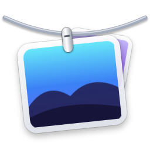
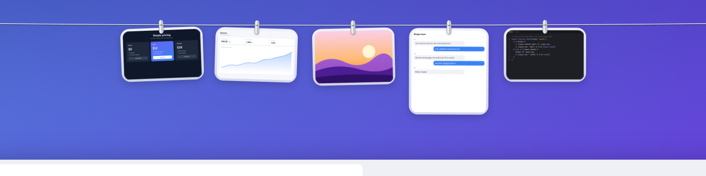
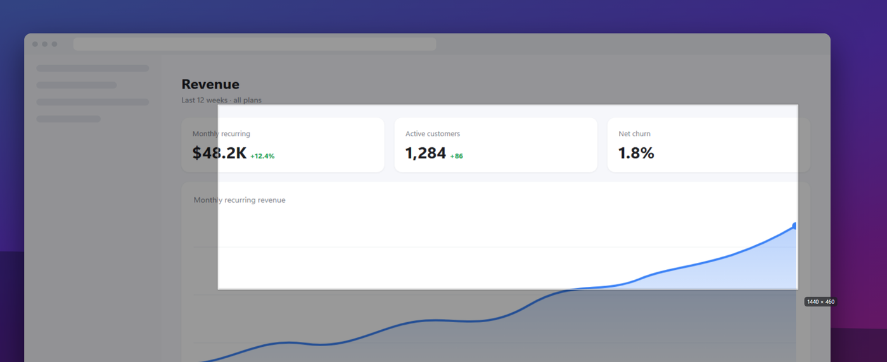
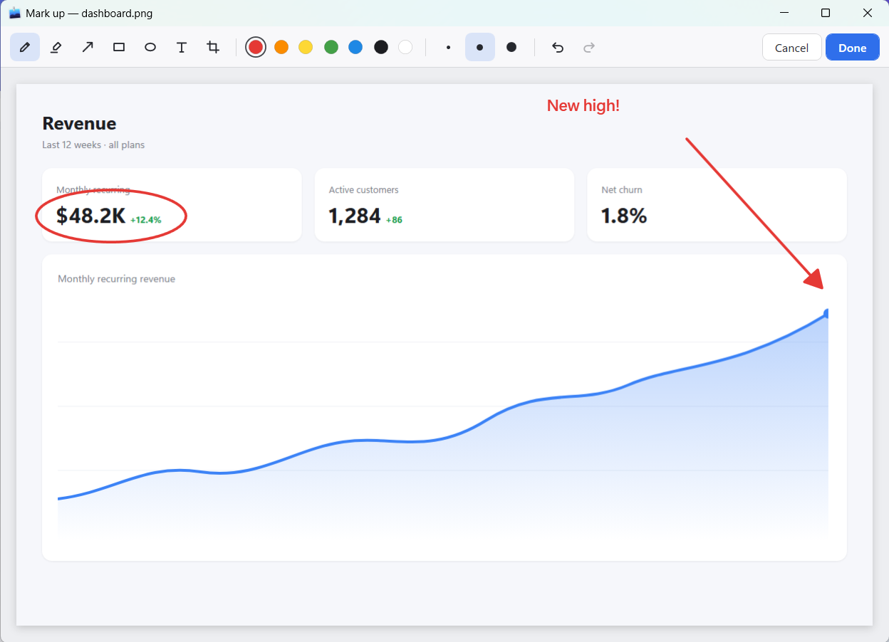

<p align="center">
  
</p>

<h1 align="center">Susharka</h1>

<p align="center">
  <b>Every screenshot, within reach.</b><br>
  A screenshot tool for Windows that hangs your captures on a clothesline at the top of the screen.
</p>

<p align="center">
  <a href="https://github.com/ilivinskyi/Susharka/releases/download/v1.0/Susharka-Setup-1.0.exe"><b>Download installer</b></a>
  &nbsp;·&nbsp;
  <a href="https://github.com/ilivinskyi/Susharka/releases/download/v1.0/Susharka.exe"><b>Download portable .exe</b></a>
  &nbsp;·&nbsp;
  <a href="https://github.com/ilivinskyi/Susharka/releases">All releases</a>
</p>

<p align="center">
  
</p>

Take a screenshot and it flies up onto a line just above the top of your screen, pegged next to the last
few you took. Rest the pointer at the top edge and the line drops down; move away and it pulls back up out
of sight. Click to copy, drag into any app, hold to mark up. Your desktop stays clean, and nothing ever
leaves your PC: no account, no network, no analytics.

<p align="center">
  
</p>

## Features

**Capture.** Press <kbd>Ctrl</kbd> + <kbd>Shift</kbd> + <kbd>4</kbd> and drag over any part of the screen.
<kbd>Enter</kbd> takes the whole screen, <kbd>Shift</kbd> keeps it square, <kbd>Esc</kbd> cancels.
Captures made with Snipping Tool or <kbd>Win</kbd> + <kbd>PrtScn</kbd> are hung on the line too.

<p align="center">
  
</p>

**Mark up.** Press and hold a photo to annotate it with pen, highlighter, arrows, shapes and text, or crop it.
<kbd>Done</kbd> saves the result back onto the line.

<p align="center">
  
</p>

### Gestures

| On a photo | What happens |
|---|---|
| Click | Copies the image to the clipboard |
| Double-click | Opens it in your image viewer |
| Press and hold | Opens the markup editor |
| Drag into an app | Shares a copy; the photo stays on the line |
| Drag into a folder or the Recycle Bin | Moves the file; the photo leaves the line |
| Hover, then × | Lets it go (the file is kept) |
| Right-click | Copy, Open, Mark up, Show in Explorer, Save as, Let go, Delete |

| Anywhere | What happens |
|---|---|
| Rest the pointer at the top edge | The line drops down on that monitor |
| Click outside the photos | The line goes away |
| <kbd>Ctrl</kbd> + <kbd>Alt</kbd> + <kbd>T</kbd> | Pins the line open, or hides it |

The line holds 8 photos. When it's full the oldest one falls off the end, and its file stays in your folder.
The line stays hidden while a full-screen app such as a video, game or slideshow is in front.

## Install

- **Installer:** run `Susharka-Setup-1.0.exe`. No admin rights needed. It adds a Start menu entry, can start
  Susharka when you sign in, and uninstalls from *Settings → Apps*.
- **Portable:** put `Susharka.exe` anywhere and run it. Nothing else is needed.

Susharka runs in the notification area. To open Settings, right-click its icon or run it again.

The builds aren't code-signed yet, so the first time Windows SmartScreen may say *"Windows protected your PC"*.
Choose **More info → Run anyway**.

Requires Windows 10 (1809) or later, 64-bit.

## Settings

Both shortcuts, the reveal delay, the number of photos, the screenshots folder, sounds and starting at sign-in
can all be changed in Settings. Screenshots are saved to `Pictures\Susharka` by default, and settings live in
`%APPDATA%\Susharka\settings.json`.

## Build from source

You need the [.NET 8 SDK](https://dotnet.microsoft.com/download/dotnet/8.0) and, for the installer,
[Inno Setup 6](https://jrsoftware.org/isinfo.php) (`winget install JRSoftware.InnoSetup`).

```bash
pwsh ./build.ps1
```

This runs the tests and writes `dist\Susharka.exe` and `dist\Susharka-Setup-<version>.exe`. The version comes
from `<Version>` in `src/Susharka/Susharka.csproj`. Use `-SkipInstaller` to build only the exe, or
`dotnet run --project src/Susharka` while developing.

```
src/Susharka/
  Core/          line model, settings, reveal timing, hotkeys, folder watcher, image I/O
  Views/         the line window, rope geometry, photo cards, gestures, flight and fall effects
  Capture/       frozen-screen crop overlay
  Markup/        annotation editor
  Preferences/   settings window, shortcut recorder
  Native/        Win32 interop, monitors and DPI, tray icon
  Anim/          springs and tweens on a single frame loop
tests/           unit tests
installer/       Inno Setup script
tools/IconGen/   draws the app icon
```

## Acknowledgements

Inspired by [Tendedero](https://github.com/alejandrobujan/tendedero) for macOS.

## License

[MIT](LICENSE)
